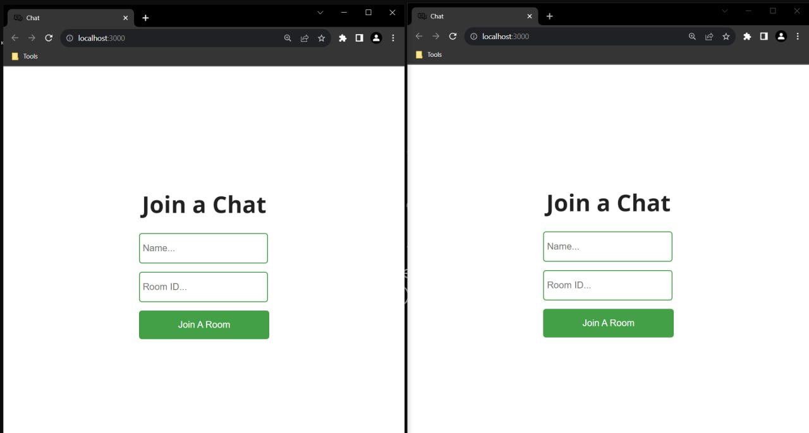
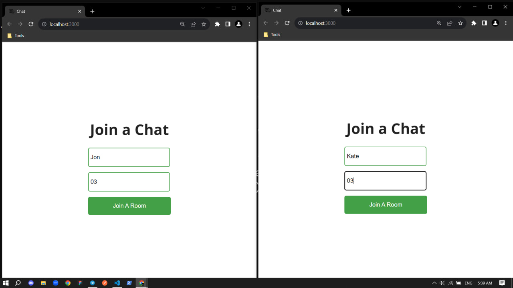
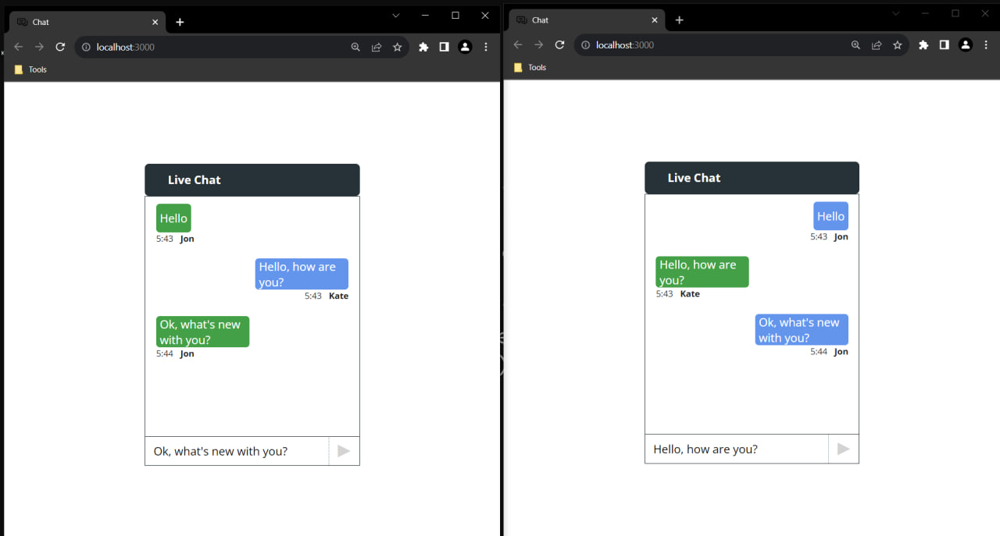

#+title:📱Chat💻

#+begin_html

		
		
		

#+end_html

Kinoway is a free and open client-based online movie service that uses the Kinopoisk API.

#+begin_center
Chat is a project in which two users can correspond if they enter the same ID when entering the chat
#+end_center

** 👉Installation
*** 1. Clone this repository:
#+begin_src bash
  git clone https://github.com/w-develop-w/chat.git
#+end_src

*** 2. Open terminal and enter in folder 'client' and input this command:
#+begin_src bash
   npm start
#+end_src

*** 3. After enter in folder 'server' and input this command:
#+begin_src bash
  npm start
#+end_src

The project will run and you can duplicate the tab and test this chat🚀

